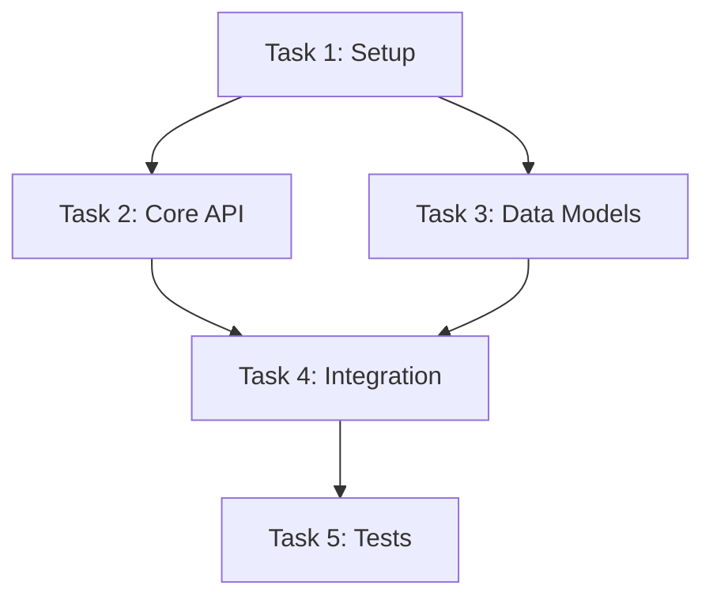

# Virtual Dev Team: Multi-Agent Orchestration System

> **For Claude:** This is a design document. Implementation will follow after user approval.

**Goal:** Build an orchestration system that coordinates multiple specialized AI agents to function as a virtual development team, capable of researching context, developing product specs, planning implementation, executing in parallel, and conducting multi-specialty code reviews.

**Architecture:** A layered system of skills and subagent prompts, with a master orchestration skill coordinating phase transitions and user checkpoints. Built on top of existing superpowers patterns (subagent-driven-development, dispatching-parallel-agents).

**Multi-Repo Support:** Designed from day one to operate across multiple repositories, with researchers and implementers able to span repo boundaries.

**Persistent Documentation:** All agents write their thinking, decisions, and progress to markdown files, enabling pause/resume, cross-agent context sharing, and comprehensive decision records.

---

## Core Concept: Agent Journals & Decision Records

### Why This Matters

Every agent writes their thinking to persistent markdown files. This enables:

1. **Pause/Resume** - Stop work anytime, resume with full context restored
2. **Cross-Agent Inspection** - Agents can read other agents' reasoning before acting
3. **Decision Archaeology** - Understand why choices were made months later
4. **Human Oversight** - Review agent thinking at any point
5. **Knowledge Transfer** - New team members can understand the journey

### Journal Structure

Each phase maintains a journal in `docs/journals/`:

```
docs/journals/
├── YYYY-MM-DD-<feature>/
│   ├── 00-session-state.json              # Machine-readable state for resume
│   ├── 01-research/
│   │   ├── architecture-researcher.md     # Thinking + findings
│   │   ├── dependencies-researcher.md
│   │   ├── features-researcher.md
│   │   ├── docs-researcher.md
│   │   └── research-synthesis.md          # Consolidated research
│   ├── 02-prd/
│   │   ├── prd-development-journal.md     # Questions asked, options considered
│   │   └── final-prd.md                   # Approved PRD
│   ├── 03-planning/
│   │   ├── decomposition-journal.md       # How tasks were broken down
│   │   └── task-plan.md                   # Final task plan
│   ├── 04-implementation/
│   │   ├── task-01-journal.md             # Per-task thinking + decisions
│   │   ├── task-02-journal.md
│   │   ├── test-engineer-journal.md       # Test strategy reasoning
│   │   └── implementation-summary.md      # Overall progress
│   ├── 05-review/
│   │   ├── architect-review.md            # Full review with reasoning
│   │   ├── security-review.md
│   │   ├── performance-review.md
│   │   └── review-synthesis.md            # Consolidated feedback
│   └── 06-decisions/
│       └── decision-record.md             # Final ADR-style document
```

### Journal Entry Format

Each journal follows a **tiered structure** for context management (see Context Management section):

```markdown
# [Agent Name] Journal - [Feature Name]

## Progress (live status - agent updates as it works)
- **Status:** Working | Complete | Blocked
- **Task:** Task 8: Add validation
- **Started:** 2026-01-16 14:30:01 UTC
- **Current Step:** Implementing input sanitization
- **Blocked?:** No | Yes - "[question for user]"

## Session Info
- **Agent:** Architecture Researcher
- **Phase:** Research Gathering

---

## Summary (Tier 1 - always passed to other agents)
[2-3 sentences: What this agent accomplished, key decisions made, final outcome.
This is what other agents will read by default.]

## Key Findings (Tier 2 - passed when relevant)
- [Bullet point: Important discovery or decision]
- [Bullet point: Another key finding]
- [Bullet point: Critical constraint identified]

---

## Full Detail (Tier 3 - available if needed, not passed by default)

### Entry 1: [Timestamp]

#### Context
[What I'm trying to accomplish]

#### Thinking
[My reasoning process - what I'm considering, why. Keep to ~500 words max.]

#### Observations
[What I found, saw, or learned]

#### Decisions Made
| Decision | Options Considered | Choice | Rationale |
|----------|-------------------|--------|-----------|
| [What] | [A, B, C] | [B] | [Why B over A and C] |

#### Open Questions
- [Questions for other agents or humans]

---

### Entry 2: [Timestamp]
...
```

**Notes:**
- **Progress section** at top is for status aggregation - agents update this as they work
- **Summary + Key Findings** are written at task completion for handoff to other agents
- **Full Detail** accumulates during work; entries >10 are collapsed to summaries
- Each agent owns exactly ONE journal file - no conflicts

### Decision Record Format (Final Document)

At the end of the workflow, consolidate into a permanent decision record:

```markdown
# Decision Record: [Feature Name]

## Summary
[One paragraph describing what was built and the key decisions]

## Timeline
| Date | Phase | Key Decision |
|------|-------|--------------|
| 2026-01-16 | Research | Chose event-driven over polling architecture |
| 2026-01-16 | PRD | Scoped to single-tenant first |
| 2026-01-17 | Implementation | Used existing auth module vs new |

## Architecture Decisions

### AD-1: Event-Driven Architecture
- **Context:** Need real-time updates across services
- **Options Considered:**
  1. Polling (simple, but latency and load issues)
  2. WebSockets (real-time, but connection management complexity)
  3. Event bus (decoupled, scalable, but operational overhead)
- **Decision:** Event bus with message queue
- **Rationale:** Decoupling benefits outweigh operational costs at our scale
- **Consequences:** Need to set up message broker, handle eventual consistency

### AD-2: [Next Decision]
...

## Alternatives Not Taken
[Document significant paths we explicitly chose NOT to pursue and why]

## Lessons Learned
[What we'd do differently, insights for future work]

## References
- [Link to research journal]
- [Link to PRD]
- [Link to implementation journals]
```

### Agent Responsibilities

**Every agent MUST:**

1. **Write before acting** - Document what you're about to do and why
2. **Write while thinking** - Capture reasoning as you work through problems
3. **Write after deciding** - Record decisions with alternatives considered
4. **Write on completion** - Summarize outcomes and lessons
5. **Write on failure** - Document what went wrong and why

**Journal writes happen:**
- At the start of each task
- When making non-trivial decisions
- When encountering unexpected situations
- When completing a task or phase
- When handing off to another agent

### Cross-Agent Reading

Agents READ journals when:
- Starting work (understand prior context)
- Making decisions that affect other agents' domains
- Reviewing another agent's work
- Consolidating outputs

Example: The Architect Reviewer reads implementation journals to understand *why* code was structured a certain way before critiquing it.

### Resume Protocol

When resuming a paused session:

1. Load `00-session-state.json` for machine state
2. Read all journals in chronological order
3. Identify last completed action
4. Summarize context for the resuming agent
5. Continue from where work stopped

---

## System Architecture

```
┌─────────────────────────────────────────────────────────────────────────────┐
│                        MASTER ORCHESTRATION LAYER                           │
│                     skill: virtual-dev-team                                 │
│  - Coordinates all phases                                                   │
│  - Manages state transitions                                                │
│  - User checkpoints between phases                                          │
│  - Multi-repo workspace coordination                                        │
└─────────────────────────────────────────────────────────────────────────────┘
                                    │
         ┌──────────────────────────┼──────────────────────────┐
         ▼                          ▼                          ▼
┌─────────────────┐    ┌─────────────────────┐    ┌────────────────────────┐
│  PHASE 1        │    │  PHASE 2            │    │  PHASE 3               │
│  Research       │───▶│  PRD Development    │───▶│  Task Decomposition    │
│  Gathering      │    │                     │    │                        │
└─────────────────┘    └─────────────────────┘    └────────────────────────┘
                                                              │
         ┌────────────────────────────────────────────────────┘
         ▼
┌─────────────────────────────────────────────────────────────────────────────┐
│  PHASE 4: Parallel Implementation                                           │
│  ┌─────────────┐  ┌─────────────┐  ┌─────────────┐  ┌─────────────┐        │
│  │ Implementer │  │ Implementer │  │ Implementer │  │ Test        │        │
│  │ Agent 1     │  │ Agent 2     │  │ Agent 3     │  │ Engineer    │        │
│  │ (Repo A)    │  │ (Repo A)    │  │ (Repo B)    │  │ Agent       │        │
│  └─────────────┘  └─────────────┘  └─────────────┘  └─────────────┘        │
└─────────────────────────────────────────────────────────────────────────────┘
                                    │
                                    ▼
┌─────────────────────────────────────────────────────────────────────────────┐
│  PHASE 5: Multi-Specialty Code Review                                       │
│  ┌─────────────┐  ┌─────────────┐  ┌─────────────┐  ┌─────────────┐        │
│  │ Spec        │  │ Architect   │  │ Security    │  │ Performance │        │
│  │ Compliance  │  │ Reviewer    │  │ Reviewer    │  │ Reviewer    │        │
│  └─────────────┘  └─────────────┘  └─────────────┘  └─────────────┘        │
│                         │                                                   │
│                         ▼                                                   │
│              ┌─────────────────────┐                                        │
│              │ Review Consolidator │──▶ Feedback Loop to Implementers      │
│              └─────────────────────┘                                        │
└─────────────────────────────────────────────────────────────────────────────┘
```

---

## Phase 1: Research Gathering

### Purpose
Dispatch parallel researcher agents to gather comprehensive context about the codebase(s), dependencies, constraints, and relevant documentation before product specification begins.

### Researcher Types (4 Parallel Agents)

| Researcher | Focus Area | Output |
|------------|------------|--------|
| **Architecture Researcher** | Code structure, patterns, conventions, module boundaries, data flow | Architecture summary with diagrams |
| **Dependencies Researcher** | External deps, internal deps, version constraints, compatibility issues | Dependency map and constraints |
| **Features Researcher** | Existing features, how they work, integration points, extension mechanisms | Feature inventory and integration points |
| **Docs Researcher** | README, API docs, design docs, external API docs, relevant standards | Curated docs list with summaries |

### Multi-Repo Handling
- Each researcher receives list of repos to investigate
- Architecture researcher maps cross-repo dependencies
- Features researcher identifies shared components
- Output includes per-repo and cross-repo findings

### Skill: `research-gathering`

**Artifacts:**
- `skills/research-gathering/SKILL.md` - Main skill document
- `skills/research-gathering/architecture-researcher-prompt.md`
- `skills/research-gathering/dependencies-researcher-prompt.md`
- `skills/research-gathering/features-researcher-prompt.md`
- `skills/research-gathering/docs-researcher-prompt.md`
- `skills/research-gathering/research-consolidator-prompt.md`

**Output Document:** `docs/research/YYYY-MM-DD-<project>-research.md`

### Journaling Requirements

Each researcher writes to `docs/journals/<feature>/01-research/<researcher-name>.md`:
- What they searched for and why
- Patterns discovered vs expected
- Decisions about what's relevant vs noise
- Open questions for other researchers or humans

The consolidator writes `research-synthesis.md` with:
- How findings were merged
- Conflicts between researcher findings and resolution
- Gaps identified in research

### Flow
```
1. User describes what they want to build (high level)
2. User identifies repos involved
3. Create journal directory structure
4. Dispatch 4 researcher agents in parallel (each writes journal)
5. Each researcher returns structured findings
6. Consolidator agent merges findings, writes synthesis journal
7. Present research summary to user for validation
8. User confirms or requests additional research
```

---

## Phase 2: PRD Development

### Purpose
Synthesize research findings into a comprehensive Product Requirements Document (PRD) through iterative collaboration with the user.

### Skill: `prd-development`

**Builds on:** `superpowers:brainstorming` patterns (one question at a time, present in sections)

**Key Differences from Brainstorming:**
- Starts with research document (not from scratch)
- Produces formal PRD structure
- Includes acceptance criteria and success metrics
- Multi-repo scope awareness

### PRD Structure
```markdown
# [Product/Feature Name] PRD

## Executive Summary
[One paragraph describing what we're building and why]

## Background
[Context from research, why this is needed]

## Goals & Non-Goals
### Goals
- [Specific, measurable goals]

### Non-Goals
- [Explicit scope boundaries]

## User Stories
- As a [user], I want [capability] so that [benefit]

## Requirements

### Functional Requirements
[FR-1] [Requirement with acceptance criteria]
[FR-2] ...

### Non-Functional Requirements
[NFR-1] Performance: ...
[NFR-2] Security: ...

## Technical Approach
[High-level architecture, informed by research]

## Multi-Repo Considerations
[Which repos affected, cross-repo dependencies]

## Success Metrics
[How we'll know this is successful]

## Open Questions
[Unresolved items for discussion]
```

### Journaling Requirements

PRD development writes to `docs/journals/<feature>/02-prd/prd-development-journal.md`:
- Questions asked and user responses
- Scope decisions (what's in, what's out, why)
- Requirements prioritization reasoning
- Alternative approaches considered for each major capability
- Trade-offs discussed with user

### Flow
```
1. Load research document
2. Present research summary to user
3. Create/update journal with initial understanding
4. Ask clarifying questions (one at a time), journal each Q&A
5. Journal scope decisions as they're made
6. Draft PRD sections iteratively (200-300 words each)
7. Validate each section with user, journal feedback
8. Finalize PRD document
9. User signs off on PRD
10. Write final journal entry summarizing key decisions
```

**Output Document:** `docs/plans/YYYY-MM-DD-<feature>-prd.md`

---

## Phase 3: Task Decomposition

### Purpose
Transform the approved PRD into a dependency-aware task graph with discrete, implementable tasks including acceptance criteria.

### Skill: `task-decomposition`

**Builds on:** `superpowers:writing-plans` patterns (bite-sized tasks, exact file paths, complete code)

**Key Additions:**
- Explicit dependency graph
- Parallelization identification
- Per-task acceptance criteria
- Multi-repo task assignment

### Task Plan Structure
```markdown
# [Feature] Implementation Plan

> **For Claude:** REQUIRED SUB-SKILL: Use superpowers:parallel-dev-team to execute this plan.

**Goal:** [From PRD]
**PRD:** [Link to PRD document]
**Repos:** [List of repos involved]

---

## Dependency Graph



## Parallelization Groups

| Group | Tasks | Can Run In Parallel |
|-------|-------|---------------------|
| 1     | T1    | No (foundation)     |
| 2     | T2, T3| Yes                 |
| 3     | T4    | No (depends on 2)   |
| 4     | T5    | No (depends on 4)   |

---

### Task 1: [Name]

**Repo:** [which repo]
**Depends On:** None
**Blocks:** T2, T3

**Acceptance Criteria:**
- [ ] [Specific, verifiable criterion]
- [ ] [Another criterion]

**Files:**
- Create: `path/to/file.py`
- Modify: `path/to/existing.py:10-25`

**Steps:**
[Detailed implementation steps per writing-plans format]

---

### Task 2: [Name]
...
```

### Journaling Requirements

Task decomposition writes to `docs/journals/<feature>/03-planning/decomposition-journal.md`:
- How requirements were broken into tasks
- Why certain task boundaries were chosen
- Dependency reasoning (why A must come before B)
- Parallelization decisions and constraints
- Task size decisions (why split or combine)
- Repo assignment rationale for multi-repo work

### Flow
```
1. Load PRD document
2. Create planning journal
3. Identify all requirements, journal understanding
4. Break requirements into discrete tasks, journal reasoning
5. Build dependency graph, journal dependency decisions
6. Identify parallelization opportunities, journal constraints
7. Assign tasks to repos, journal rationale
8. Define acceptance criteria per task
9. Present plan to user for approval
10. Journal any user feedback and adjustments
11. User approves
```

**Output Document:** `docs/plans/YYYY-MM-DD-<feature>-tasks.md`

---

## Phase 4: Parallel Implementation

### Purpose
Execute tasks with maximum parallelization while respecting dependencies, spawning test engineers after each implementation.

### Skill: `parallel-dev-team`

**Builds on:**
- `superpowers:subagent-driven-development` (fresh context per task)
- `superpowers:dispatching-parallel-agents` (parallel execution)

### Execution Strategy

```
1. Parse task plan, build execution graph
2. Identify ready tasks (no unmet dependencies)
3. Dispatch implementer agents for ready tasks in parallel
4. As each completes:
   a. Dispatch test-engineer agent
   b. Mark task complete
   c. Check for newly unblocked tasks
   d. Dispatch next batch
5. Continue until all tasks complete
6. Trigger Phase 5 (review)
```

### New Subagent: Test Engineer

**Purpose:** Write comprehensive tests for implemented code.

**Prompt Template:** `skills/parallel-dev-team/test-engineer-prompt.md`

**Responsibilities:**
- Read the implementation
- Read the acceptance criteria
- Write unit tests covering acceptance criteria
- Write integration tests if cross-component
- Verify all tests pass
- Report coverage and gaps

### Journaling Requirements

**Each implementer** writes to `docs/journals/<feature>/04-implementation/task-NN-journal.md`:
- Initial understanding of the task
- Implementation approach chosen (and alternatives considered)
- Problems encountered and how they were solved
- Deviations from plan and why
- Self-review findings before handoff

**Test engineer** writes to `docs/journals/<feature>/04-implementation/test-engineer-journal.md`:
- Test strategy reasoning
- Coverage decisions (what to test, what to skip, why)
- Edge cases identified
- Test patterns chosen

**Implementation summary** (`implementation-summary.md`) updated after each task:
- Tasks completed vs remaining
- Cumulative decisions made
- Cross-task patterns emerging
- Blockers or concerns

### Multi-Repo Coordination
- Each implementer agent receives repo context
- Cross-repo tasks get context from both repos
- Git worktrees used per repo
- Commits coordinated across repos
- Journals indicate which repo each decision affects

### Artifacts
- `skills/parallel-dev-team/SKILL.md`
- `skills/parallel-dev-team/implementer-prompt.md` (extend existing)
- `skills/parallel-dev-team/test-engineer-prompt.md` (new)

---

## Phase 5: Specialist Code Review Subagents

### Purpose
Dispatch independent specialist reviewers as separate subagents, each deeply focused on their domain. They run in parallel and return structured findings.

### Design Philosophy
Each reviewer is a **standalone specialist subagent** - not a generalist doing multiple checks. This mirrors how real dev teams work: you have a security expert, a performance expert, an architect, etc. Each brings deep domain expertise.

### Specialist Subagents

#### 1. Spec Compliance Reviewer (existing)
- **Focus:** Does code match requirements exactly?
- **Mindset:** Skeptical auditor checking acceptance criteria line-by-line
- **Output:** APPROVED or list of unmet/exceeded requirements

#### 2. Architect Reviewer (new)
- **Focus:** Design quality, patterns, modularity, maintainability
- **Mindset:** Senior architect reviewing for long-term health
- **Examines:**
  - Module boundaries and responsibilities
  - Dependency direction (are abstractions depending on details?)
  - Interface design (is it minimal and clear?)
  - Consistency with existing patterns
  - Coupling and cohesion
  - Future extensibility without overengineering
- **Output:** APPROVED or architectural concerns with recommendations

#### 3. Security Reviewer (new)
- **Focus:** Vulnerabilities, attack vectors, data protection
- **Mindset:** Adversarial red-teamer trying to break the code
- **Examines:**
  - OWASP Top 10 (injection, XSS, CSRF, etc.)
  - Input validation and sanitization
  - Authentication and authorization logic
  - Secrets handling (hardcoded keys, logging sensitive data)
  - Data exposure (PII, tokens in URLs/logs)
  - Dependency vulnerabilities
  - Error messages leaking internals
- **Output:** APPROVED or security findings with severity ratings

#### 4. Performance Reviewer (new)
- **Focus:** Efficiency, scaling characteristics, resource usage
- **Mindset:** SRE anticipating production load
- **Examines:**
  - Database query patterns (N+1, missing indexes, full table scans)
  - Memory allocation (leaks, unbounded growth, large objects)
  - Algorithm complexity (O(n²) where O(n) is possible)
  - Caching opportunities and cache invalidation
  - Concurrency issues (race conditions, deadlocks)
  - Network round trips and batching
  - Resource cleanup (connections, file handles)
- **Output:** APPROVED or performance concerns with impact estimates

### Subagent Independence

Each reviewer:
- Receives the same context (changed files, git diff, task description)
- Works independently without knowledge of other reviewers
- Returns structured findings in consistent format
- Has no awareness of or dependency on other reviews

This enables true parallel execution and prevents groupthink.

### Review Orchestration

The `parallel-dev-team` skill (Phase 4) handles review orchestration:

```
1. Implementation completes
2. Determine which reviewers are relevant (smart selection):
   - Spec Compliance: ALWAYS
   - Security: if auth/crypto/input handling/API code changed
   - Performance: if DB/loops/data structures/caching code changed
   - Architect: if new modules/interfaces/cross-cutting code changed
3. Dispatch relevant reviewers in parallel as separate subagents
4. Collect all responses
5. Consolidate findings into unified feedback
6. If any CHANGES_REQUESTED:
   a. Present to user
   b. Dispatch fix agents
   c. Re-run relevant reviewers
7. If all APPROVED: proceed
```

### Structured Feedback Format

Each reviewer returns:
```markdown
## [Specialty] Review

**Verdict:** APPROVED | CHANGES_REQUESTED

### Findings

#### Critical (must fix before merge)
- `file.py:45` - [Description of issue and why it's critical]

#### Important (should fix)
- `file.py:89` - [Description and recommendation]

#### Minor (consider fixing)
- `file.py:12` - [Suggestion]

### Summary
[1-2 sentence overall assessment]
```

### Consolidated View

After all reviewers complete, present unified summary:
```markdown
## Code Review Summary

| Reviewer | Verdict | Critical | Important | Minor |
|----------|---------|----------|-----------|-------|
| Spec Compliance | APPROVED | 0 | 0 | 0 |
| Security | CHANGES_REQUESTED | 1 | 2 | 0 |
| Architect | APPROVED | 0 | 1 | 1 |
| Performance | CHANGES_REQUESTED | 0 | 1 | 2 |

### Critical Issues (blocking)
1. **[Security]** `api/users.py:45` - SQL injection via unsanitized user input

### Important Issues
1. **[Security]** `auth/token.py:23` - Token expiry not validated
2. **[Security]** `api/users.py:67` - Missing rate limiting
3. **[Architect]** Consider extracting `DataProcessor` to separate module
4. **[Performance]** `orders/service.py:89` - N+1 query in `get_all_orders()`
```

### Journaling Requirements

**Each specialist reviewer** writes to `docs/journals/<feature>/05-review/<specialty>-review.md`:
- Files examined and why
- Reasoning behind each finding (not just "this is bad" but "this is bad because...")
- Severity justification (why critical vs important vs minor)
- Alternative solutions considered for each issue
- Context from implementation journals consulted
- Confidence level in findings

**Review synthesis** (`review-synthesis.md`):
- How findings from all reviewers were prioritized
- Conflicts between reviewers and resolution
- Patterns across reviewers (same code flagged by multiple specialists)
- Overall assessment with reasoning

This is critical for:
- Implementers understanding WHY changes are needed
- Learning from reviews across projects
- Calibrating reviewer focus over time

### Artifacts
- `skills/subagent-driven-development/architect-reviewer-prompt.md` (new)
- `skills/subagent-driven-development/security-reviewer-prompt.md` (new)
- `skills/subagent-driven-development/performance-reviewer-prompt.md` (new)

These live alongside the existing `spec-reviewer-prompt.md` and `code-quality-reviewer-prompt.md`.

---

## Master Orchestration: virtual-dev-team Skill

### Purpose
Coordinate all phases, manage state transitions, and provide user checkpoints.

### Skill: `virtual-dev-team`

### State Machine

```
START
  │
  ▼
RESEARCH_GATHERING
  │ (user approves research)
  ▼
PRD_DEVELOPMENT
  │ (user approves PRD)
  ▼
TASK_DECOMPOSITION
  │ (user approves plan)
  ▼
IMPLEMENTATION
  │ (all tasks complete)
  ▼
REVIEW
  │ (all reviewers approve)
  ▼
COMPLETE
```

### User Checkpoints

| Checkpoint | User Action | Can Go Back? |
|------------|-------------|--------------|
| After Research | Approve / Request more research | Yes |
| After PRD | Approve / Revise PRD | Yes |
| After Plan | Approve / Adjust plan | Yes |
| During Implementation | Pause / Continue / Abort | Yes |
| After Review | Accept / Request changes | Yes |
| Final | Merge / Hold | - |

### Session State Document

To enable pause/resume, maintain state in:
`docs/plans/YYYY-MM-DD-<feature>-state.json`

```json
{
  "feature": "user-authentication",
  "phase": "IMPLEMENTATION",
  "repos": ["repo-a", "repo-b"],
  "research_doc": "docs/research/...",
  "prd_doc": "docs/plans/...-prd.md",
  "task_plan": "docs/plans/...-tasks.md",
  "tasks": {
    "T1": {"status": "complete", "commit": "abc123"},
    "T2": {"status": "in_progress"},
    "T3": {"status": "pending"}
  },
  "review_round": 1,
  "review_status": null
}
```

### Final Decision Record

At workflow completion, the orchestrator generates `docs/journals/<feature>/06-decisions/decision-record.md`:
- Consolidates key decisions from all phase journals
- Formats as permanent ADR-style document
- Links to all source journals for deep-dive
- Captures lessons learned and alternatives not taken

This becomes the lasting artifact explaining "why we built it this way."

### Artifacts
- `skills/virtual-dev-team/SKILL.md`
- `skills/virtual-dev-team/journal-template.md`
- `commands/dev-team.md` (slash command)

---

## Implementation Phases

### Phase A: Foundation (Do First)
1. `research-gathering` skill + 4 researcher prompts + consolidator
2. Integration test for research phase

### Phase B: PRD Development
3. `prd-development` skill
4. Integration test for PRD phase

### Phase C: Task Planning
5. `task-decomposition` skill (builds on writing-plans)
6. Integration test for decomposition

### Phase D: Parallel Implementation
7. `parallel-dev-team` skill
8. `test-engineer-prompt.md`
9. Integration test for parallel implementation

### Phase E: Specialist Reviewers
10. `architect-reviewer-prompt.md` (in subagent-driven-development)
11. `security-reviewer-prompt.md` (in subagent-driven-development)
12. `performance-reviewer-prompt.md` (in subagent-driven-development)
13. Integration test for specialist review dispatch

### Phase F: Master Orchestration
14. `virtual-dev-team` skill (ties it all together)
15. `/dev-team` slash command
16. End-to-end integration test

---

## File Structure (Final State)

```
skills/
├── virtual-dev-team/
│   ├── SKILL.md                           # Master orchestrator
│   └── journal-template.md                # Standard journal format
├── research-gathering/
│   ├── SKILL.md
│   ├── architecture-researcher-prompt.md
│   ├── dependencies-researcher-prompt.md
│   ├── features-researcher-prompt.md
│   ├── docs-researcher-prompt.md
│   └── research-consolidator-prompt.md
├── prd-development/
│   └── SKILL.md
├── task-decomposition/
│   └── SKILL.md
├── parallel-dev-team/
│   ├── SKILL.md
│   ├── implementer-prompt.md
│   └── test-engineer-prompt.md
└── subagent-driven-development/
    ├── SKILL.md                           # (existing)
    ├── implementer-prompt.md              # (existing)
    ├── spec-reviewer-prompt.md            # (existing)
    ├── code-quality-reviewer-prompt.md    # (existing)
    ├── architect-reviewer-prompt.md       # NEW - specialist subagent
    ├── security-reviewer-prompt.md        # NEW - specialist subagent
    └── performance-reviewer-prompt.md     # NEW - specialist subagent

commands/
└── dev-team.md                            # /dev-team slash command

tests/
└── claude-code/
    ├── test-research-gathering.sh
    ├── test-prd-development.sh
    ├── test-task-decomposition.sh
    ├── test-parallel-dev-team.sh
    ├── test-specialist-reviewers.sh
    ├── test-journaling.sh                 # Verify agents write journals
    └── test-virtual-dev-team-e2e.sh

# Per-project output (created during execution)
docs/journals/
└── YYYY-MM-DD-<feature>/
    ├── 00-session-state.json           # Machine-readable state (orchestrator owns)
    ├── 01-research/
    │   ├── architecture-researcher.md  # Each agent owns its journal
    │   ├── dependencies-researcher.md
    │   ├── features-researcher.md
    │   ├── docs-researcher.md
    │   └── research-synthesis.md
    ├── 02-prd/
    ├── 03-planning/
    ├── 04-implementation/
    │   ├── task-01-implementer.md      # Per-task journals
    │   ├── task-02-implementer.md
    │   └── test-engineer.md
    ├── 05-review/
    │   ├── spec-compliance.md          # Per-reviewer journals
    │   ├── architect.md
    │   ├── security.md
    │   └── performance.md
    └── 06-decisions/
```

---

## Design Decisions

1. **Review parallelization:** Smart selection - only invoke relevant reviewers based on changed files:
   - Security reviewer: auth, crypto, input handling, API endpoints
   - Performance reviewer: database access, loops, data structures, caching
   - Architect reviewer: new modules, interface changes, cross-cutting concerns
   - Spec compliance: always runs

2. **Cross-repo commits:** Per-repo commits with cross-references in commit messages. Example:
   ```
   feat(api): add user authentication endpoint

   Related: repo-b#abc123 (frontend auth components)
   Part of: virtual-dev-team/user-auth-feature
   ```

3. **Cost management:** No limits initially. Build and validate the system first, add budget controls in future iteration if needed.

## Failure Modes & Recovery

### Core Principle: Ask When Stuck

**Every agent prompt includes this instruction:**
> If you encounter confusion, ambiguity, blocking issues, or aren't sure how to proceed, STOP and ask the user for guidance. Do not guess. Do not proceed with uncertainty. Write your question to the status file and wait for user input.

### Failure Types & Responses

| Failure Type | Detection | Response |
|--------------|-----------|----------|
| **Agent timeout** | No response within timeout | Log to status, retry once, then escalate to user |
| **Agent error** | Tool/API error | Log error details, ask user if retriable |
| **Agent confused** | Agent self-reports uncertainty | Agent asks user via status file, waits |
| **Invalid output** | Output doesn't match expected format | Log issue, ask agent to retry with clarification |
| **Repeated failures** | Same task fails 2+ times | Stop, present full context to user, ask for guidance |
| **Review loop > 3 rounds** | Counter exceeds threshold | Pause, show user the back-and-forth, ask for resolution |

### Escalation Protocol

```
Agent encounters problem
    │
    ▼
Can agent resolve independently? (missing info it can find, simple retry)
    │
    ├─ Yes → Agent resolves, journals the issue and resolution
    │
    └─ No → Agent escalates:
            1. Write to status.md: "BLOCKED: [agent] needs help"
            2. Write detailed question to journal
            3. Update session-state.json with blocked status
            4. STOP and wait for user

User responds
    │
    ▼
Agent reads response, journals it, continues
```

### What Agents Should Ask About

**Always ask (never guess):**
- Ambiguous requirements ("should this handle X case?")
- Missing context ("I can't find where Y is defined")
- Conflicting information ("research says A, but code does B")
- Scope uncertainty ("is Z in scope or out?")
- Technical trade-offs that need human judgment

**Don't ask (figure it out):**
- Implementation details within clear requirements
- Standard patterns (use what's in the codebase)
- Obvious fixes during review feedback

### Recovery Checkpoints

Each phase completion is a **recovery checkpoint**:
- State saved to `session-state.json`
- All journals written
- Can resume from this point if later phase fails catastrophically

If implementation goes badly wrong, user can:
1. Reset to post-planning checkpoint
2. Adjust the plan
3. Re-run implementation

### Cascade Failure Prevention

To prevent bad research from poisoning everything:

1. **Research validation gate**: User reviews consolidated research before PRD begins
2. **PRD traceability**: Every requirement must trace to research finding or user input
3. **Plan traceability**: Every task must trace to requirement
4. **Implementation verification**: Tests verify behavior, not just "code exists"

If user catches an issue late:
- Can go back to any checkpoint
- Journals explain WHY decisions were made
- Easier to identify where things went wrong

---

## Context Management

### The Problem

With extensive journaling + cross-agent reading, context can explode:
- 4 researcher journals (each potentially large)
- Accumulated implementation journals
- Reviewers reading journals + code + diffs

### Strategies

#### 1. Tiered Journal Content

Each journal has three tiers:

```markdown
## Summary (always included in handoffs)
[2-3 sentences: what was done, key decisions, outcome]

## Key Findings (included when relevant)
[Bullet points of important discoveries/decisions]

## Full Detail (available if needed, not passed by default)
[Complete thinking, all observations, raw data]
```

When one agent reads another's journal, they get **Summary + Key Findings** by default. Full detail only if they need to dig deeper.

#### 2. Progressive Summarization

As work progresses, older entries get summarized:

```
Entry 1: Full detail (current)
Entry 2: Full detail (current)
Entry 3: Full detail (recent)
Entry 4: Summary only (older)
Entry 5: Summary only (older)
```

The orchestrator manages this automatically.

#### 3. Context Budgets

Rough guidelines per agent type:

| Agent Type | Input Context Budget | Notes |
|------------|---------------------|-------|
| Researcher | Low | Mostly exploring, not reading prior work |
| PRD Developer | Medium | Reads research summaries |
| Task Planner | Medium | Reads PRD + research summaries |
| Implementer | Low-Medium | Task text + relevant context only |
| Test Engineer | Low | Implementation + acceptance criteria |
| Reviewer | Medium | Code + diff + implementation summary |
| Consolidator | Medium-High | Reads multiple agent outputs |

#### 4. Handoff Formats

What gets passed between phases:

| From | To | What's Passed |
|------|-----|---------------|
| Research | PRD | Research synthesis (summary) + link to full journals |
| PRD | Planning | Final PRD doc (not journal) |
| Planning | Implementation | Task plan + relevant research excerpts |
| Implementation | Review | Code diff + task summary + acceptance criteria |
| Review | Fix Agent | Specific findings + relevant code context |

#### 5. Journal Size Limits

Soft guidelines to keep journals useful:

- **Per-entry**: ~500 words max for thinking section
- **Per-journal**: Summarize after 10 entries
- **Research findings**: Bullet points, not prose
- **Code in journals**: Only relevant snippets, not full files

---

## Progress Visibility (Status Dashboard)

### Design: Per-Agent Progress + On-Demand Aggregation

**Problem:** Multiple parallel agents writing to a single status file causes race conditions and file conflicts.

**Solution:** Each agent tracks progress in its own journal. Status is aggregated on demand.

### Per-Agent Progress Tracking

Each agent's journal includes a **Progress Header** that it updates as it works:

```markdown
# [Agent Name] Journal - [Feature Name]

## Progress
- **Status:** Working | Complete | Blocked
- **Task:** Task 8: Add validation
- **Started:** 2026-01-16 14:30:01 UTC
- **Current Step:** Implementing input sanitization
- **Blocked?:** Yes - "Should validation reject empty strings or treat as null?"

---

## Session Info
...rest of journal...
```

**No conflicts:** Each agent only writes to its own journal file.

### Status Aggregation

When you want to see overall status, the orchestrator (or a lightweight status command) reads all journal Progress headers and compiles a unified view:

```markdown
# Virtual Dev Team Status: [Feature Name]

**Generated:** 2026-01-16 14:32:05 UTC
**Phase:** IMPLEMENTATION
**Overall Progress:** 7/12 tasks complete

---

## Active Agents

| Agent | Task | Status | Started |
|-------|------|--------|---------|
| Implementer-3 | Task 8: Add validation | Working | 14:30:01 |
| Test-Engineer | Task 7: Auth tests | Writing tests | 14:31:22 |

## Blocked / Needs Attention

| Agent | Issue | Waiting Since |
|-------|-------|---------------|
| Implementer-3 | "Should validation reject empty strings or treat as null?" | 14:32:00 |

## Completed This Session

| Agent | Task | Result | Duration |
|-------|------|--------|----------|
| Implementer-2 | Task 7: Auth endpoint | Done | 3m 42s |
| Implementer-1 | Task 6: User model | Done | 2m 18s |

## Queue

| Task | Dependencies | Status |
|------|--------------|--------|
| Task 9: Integration | Waiting on T7, T8 | Queued |
| Task 10: Error handling | Waiting on T9 | Queued |

## Phase Summary

| Phase | Status | Key Outcome |
|-------|--------|-------------|
| Research | Complete | 4 researchers, 23 findings |
| PRD | Complete | 8 requirements defined |
| Planning | Complete | 12 tasks, 4 parallel groups |
| Implementation | In Progress | 7/12 tasks done |
| Review | Pending | - |
```

### Aggregation Options

**Option 1: Ask the orchestrator**
User says "show status" → orchestrator reads journals → presents unified view

**Option 2: Lightweight script**
```bash
# Script that parses journal Progress headers
./show-status.sh docs/journals/my-feature/
```

**Option 3: Periodic writes by orchestrator**
Orchestrator periodically (every 30s?) writes `status.md` - only ONE writer, no conflicts.
Not real-time, but close enough for monitoring.

### Blocked State Handling

When an agent blocks:

1. Agent updates its own journal Progress header: `Blocked?: Yes - "[question]"`
2. Agent writes detailed context to its journal Full Detail section
3. Agent updates `session-state.json` (orchestrator owns this file, agents append to a queue)
4. Agent stops and waits

Orchestrator detects blocked agents by reading journal headers, surfaces to user.

### Trade-offs

| Approach | Pros | Cons |
|----------|------|------|
| Per-agent + on-demand | No conflicts, simple | Not real-time, requires explicit "show status" |
| Per-agent + periodic aggregation | No conflicts, somewhat fresh | Slight delay, orchestrator must run |
| Single file (rejected) | Real-time view | Race conditions, file conflicts |

**Recommendation:** Start with on-demand aggregation. Add periodic writes later if needed.

---

## Claude Code Hooks Integration

Hooks provide automatic behaviors that make the system more seamless.

### Hook 1: Auto-Resume Detection (SessionStart)

**Purpose:** When starting a session, detect in-progress virtual-dev-team work and offer to resume.

**Trigger:** SessionStart (startup, resume, clear, compact)

**Behavior:**
```
1. Check for docs/journals/*/00-session-state.json files
2. If found with status != COMPLETE:
   - Read session state
   - Inject context: "Found in-progress work: [feature name], Phase: [phase], Progress: [X/Y tasks]"
   - Prompt: "Resume this work, start fresh, or ignore?"
3. If resumed:
   - Load full context from journals
   - Continue from last checkpoint
```

**Implementation:** Extend `hooks/session-start.sh` to check for session state files.

### Hook 2: Journal Auto-Setup (PreToolUse on Task)

**Purpose:** Before dispatching any subagent, ensure its journal file exists with proper headers.

**Trigger:** PreToolUse with matcher `Task`

**Behavior:**
```
1. Parse the Task tool call to extract agent info
2. Determine journal path based on agent type and current phase
3. If journal doesn't exist:
   - Create file with Progress header template
   - Initialize Session Info section
4. Return context reminding agent to update journal
```

**Benefits:**
- Agents always have a journal ready
- Consistent structure across all journals
- No "forgot to create journal" failures

### Hook 3: File Modification Tracking (PreToolUse on Edit/Write) [Future]

**Purpose:** Track which files are modified by which agent for conflict detection.

**Trigger:** PreToolUse with matcher `Edit|Write`

**Behavior:**
```
1. Log: [timestamp] [agent-id] [action] [file-path]
2. Check if another agent is currently working on this file
3. If conflict detected:
   - Warn in hook output
   - Agent sees warning before proceeding
```

**Implementation:** Maintain a simple lock file or modification log.

**Note:** This is more complex - defer to v1.1 unless conflicts become a real problem.

### Hook 4: Status on Demand (Custom Command) [Future]

**Purpose:** Quick status check without full orchestrator involvement.

**Trigger:** User types `/dev-team-status` or similar

**Behavior:**
```
1. Scan all journal Progress headers
2. Compile unified status view
3. Display to user
```

**Implementation:** Could be a slash command rather than a hook.

### Hooks File Structure

```
hooks/
├── hooks.json                        # Hook configuration
├── session-start.ps1                 # Extended for auto-resume
├── pre-task-journal-setup.ps1        # New: journal auto-creation
└── pre-edit-track-files.ps1          # Future: conflict tracking
```

### hooks.json Updates

```json
{
  "hooks": {
    "SessionStart": [
      {
        "matcher": "startup|resume|clear|compact",
        "hooks": [
          {
            "type": "command",
            "command": "powershell -ExecutionPolicy Bypass -File \"${CLAUDE_PLUGIN_ROOT}/hooks/session-start.ps1\""
          }
        ]
      }
    ],
    "PreToolUse": [
      {
        "matcher": "Task",
        "hooks": [
          {
            "type": "command",
            "command": "powershell -ExecutionPolicy Bypass -File \"${CLAUDE_PLUGIN_ROOT}/hooks/pre-task-journal-setup.ps1\""
          }
        ]
      }
    ]
  }
}
```

### PowerShell Hook Template

```powershell
# Example: session-start.ps1
param()

$ErrorActionPreference = "Stop"

# Find in-progress sessions
$journalDirs = Get-ChildItem -Path "docs/journals" -Directory -ErrorAction SilentlyContinue

$inProgress = @()
foreach ($dir in $journalDirs) {
    $stateFile = Join-Path $dir.FullName "00-session-state.json"
    if (Test-Path $stateFile) {
        $state = Get-Content $stateFile | ConvertFrom-Json
        if ($state.phase -ne "COMPLETE") {
            $inProgress += @{
                Feature = $state.feature
                Phase = $state.phase
                Path = $stateFile
            }
        }
    }
}

# Build context injection
$context = ""
if ($inProgress.Count -gt 0) {
    $session = $inProgress[0]
    $context = @"
<VIRTUAL_DEV_TEAM_RESUME>
Found in-progress work: $($session.Feature)
Phase: $($session.Phase)
State file: $($session.Path)

Ask user: "Resume this work, start fresh, or ignore?"
</VIRTUAL_DEV_TEAM_RESUME>
"@
}

# Output JSON for Claude Code
$output = @{
    hookSpecificOutput = @{
        hookEventName = "SessionStart"
        additionalContext = $context
    }
} | ConvertTo-Json -Depth 10 -Compress

Write-Output $output
```

### PowerShell Notes

**Why PowerShell:**
- Native on Windows (no Git Bash dependency)
- Better JSON handling (`ConvertTo-Json`, `ConvertFrom-Json`)
- Cleaner syntax for file operations
- Consistent with Windows development environment

**Execution Policy:**
- Use `-ExecutionPolicy Bypass` to avoid policy issues
- Scripts are local/trusted, bypass is safe here

**Cross-Platform (Future):**
- If needed later, can add `.sh` equivalents
- Or use PowerShell Core (pwsh) which runs on Linux/Mac
- For now, Windows-only is fine

### Implementation Priority

| Hook | Priority | Complexity | Value |
|------|----------|------------|-------|
| Auto-resume (SessionStart) | High | Low | Huge for pause/resume workflow |
| Journal auto-setup (PreToolUse Task) | Medium | Medium | Ensures consistency |
| File tracking (PreToolUse Edit/Write) | Low | High | Only if conflicts are common |
| Status command | Low | Low | Nice-to-have |

**Recommendation:** Build auto-resume hook as part of Phase F (master orchestration). Journal auto-setup can be added in Phase D (parallel implementation) when we first dispatch multiple agents.

---

## Open Questions (Remaining)

1. **State persistence:** Is JSON file sufficient, or do we need something more robust?

---

## Success Criteria

The system is successful when:

1. A user can describe a feature idea and have researchers automatically gather relevant context
2. Research is synthesized into a structured PRD with user collaboration
3. PRD is decomposed into parallel-executable tasks with clear dependencies
4. Tasks execute in parallel where possible, sequentially where required
5. Each implementation gets tested by a dedicated test engineer
6. Four specialized reviewers examine all code changes
7. Review feedback loops back to implementers until all approve
8. The entire flow can be paused and resumed
9. Multi-repo development works seamlessly
