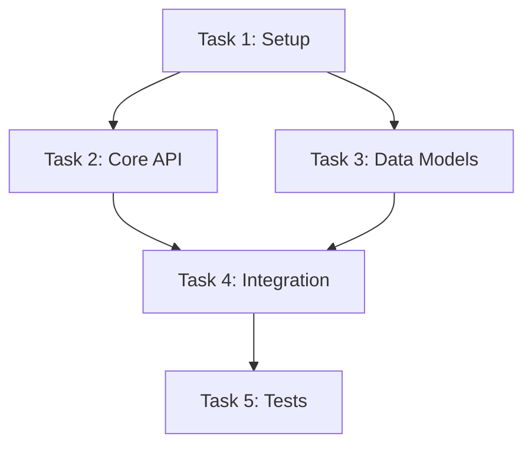
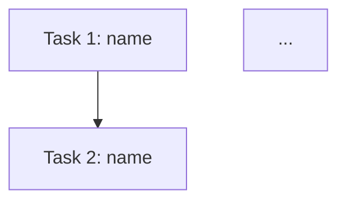

# Task Decomposition

Transform an approved PRD into a dependency-aware task graph with discrete, implementable tasks including acceptance criteria.

**Core principle:** Dependency-aware + parallel-optimized + bite-sized tasks = efficient parallel implementation

## When to Use

Use this skill when:
- PRD is approved and ready for implementation
- Need to break requirements into implementable tasks
- Want to enable parallel execution where possible
- Multi-repo coordination is needed

Do NOT use when:
- PRD isn't finalized (use `superpowers:prd-development` first)
- Simple single-task change (just implement directly)
- Exploratory work without clear requirements

## Prerequisites

Before starting task decomposition:
1. PRD document exists and is approved by user
2. Research synthesis is available for reference
3. Journal directory exists: `docs/journals/YYYY-MM-DD-<feature>/`

## The Process

```
1. Load PRD document
2. Create planning journal: docs/journals/<feature>/03-planning/decomposition-journal.md
3. Extract all requirements from PRD
4. For each requirement:
   a. Break into discrete tasks (2-5 min steps)
   b. Identify files to create/modify
   c. Define acceptance criteria
   d. Journal reasoning
5. Build dependency graph:
   a. Which tasks depend on others?
   b. Which can run in parallel?
6. Assign tasks to repos (if multi-repo)
7. Create parallelization groups
8. Present plan to user for approval
9. User approves or requests changes
```

## Task Granularity

**Each task should be:**
- Completable in one focused session
- Independently testable
- Small enough to review easily
- Large enough to be meaningful

**Each step within a task should be:**
- One action (2-5 minutes)
- Have clear expected output
- Be verifiable

**Example breakdown:**
```
Task: Add user validation endpoint

Step 1: Write failing test for validation endpoint
Step 2: Run test, verify it fails
Step 3: Implement minimal endpoint to pass test
Step 4: Run test, verify it passes
Step 5: Add edge case tests
Step 6: Implement edge case handling
Step 7: Run all tests
Step 8: Commit
```

## Dependency Graph

**Identify dependencies:**
- Data dependencies (Task B needs output of Task A)
- API dependencies (Task B uses API from Task A)
- Structural dependencies (Task B modifies file created by Task A)

**Document with Mermaid:**


## Parallelization Groups

**Group tasks by execution order:**

| Group | Tasks | Dependencies Met | Can Parallelize |
|-------|-------|------------------|-----------------|
| 1 | T1 | None needed | No (single task) |
| 2 | T2, T3 | T1 complete | Yes |
| 3 | T4 | T2, T3 complete | No (single task) |
| 4 | T5 | T4 complete | No (single task) |

**Rules:**
- Tasks in same group can run in parallel
- All tasks in group N must complete before group N+1 starts
- Within a group, tasks have no dependencies on each other

## Task Plan Structure

```markdown
# [Feature] Implementation Plan

> **For Claude:** REQUIRED SUB-SKILL: Use superpowers:parallel-dev-team to execute this plan.

**Goal:** [From PRD - one sentence]
**PRD:** [Link to PRD document]
**Research:** [Link to research synthesis]
**Repos:** [List of repos involved]

---

## Dependency Graph



## Parallelization Groups

| Group | Tasks | Can Run In Parallel |
|-------|-------|---------------------|
| 1 | T1 | No (foundation) |
| 2 | T2, T3 | Yes |
| 3 | T4 | No (depends on 2) |

---

## Tasks

### Task 1: [Name]

**Repo:** [which repo]
**Depends On:** None
**Blocks:** T2, T3
**Requirement:** [FR-X from PRD]

**Acceptance Criteria:**
- [ ] [Specific, verifiable criterion]
- [ ] [Another criterion]
- [ ] Tests pass

**Files:**
- Create: `path/to/new-file.ts`
- Modify: `path/to/existing.ts:10-25`
- Test: `tests/path/to/test.ts`

**Steps:**

**Step 1: Write failing test**
```typescript
// Exact code to write
```
Run: `npm test path/to/test.ts`
Expected: FAIL - "function not defined"

**Step 2: Implement minimal code**
```typescript
// Exact code to write
```
Run: `npm test path/to/test.ts`
Expected: PASS

**Step 3: Commit**
```bash
git add path/to/files
git commit -m "feat: add [feature]"
```

---

### Task 2: [Name]
...
```

## Journaling Requirements

**Write to:** `docs/journals/<feature>/03-planning/decomposition-journal.md`

**Journal Format:**

```markdown
# Task Decomposition Journal - [Feature Name]

## Progress
- **Status:** Working | Complete | Blocked
- **Started:** [timestamp]
- **Current Step:** [what you're doing now]
- **Blocked?:** No | Yes - "[specific question]"

## Session Info
- **Agent:** Task Planner
- **Phase:** Task Decomposition
- **PRD:** [link]

---

## Summary
[2-3 sentences: How requirements were broken into tasks]

## Key Findings
- [Bullet: Number of tasks identified]
- [Bullet: Key dependency discovered]
- [Bullet: Parallelization opportunity]

---

## Full Detail

### Requirements Breakdown

| Requirement | Tasks | Rationale |
|-------------|-------|-----------|
| FR-1 | T1, T2 | [Why this breakdown] |
| FR-2 | T3 | [Why] |

### Dependency Reasoning

| Dependency | Why |
|------------|-----|
| T2 depends on T1 | T2 uses API created in T1 |
| T3 depends on T1 | T3 modifies file created in T1 |

### Task Sizing Decisions

| Decision | Reasoning |
|----------|-----------|
| Split T2 into T2a, T2b | Original too large, natural split point |
| Combined X and Y into T3 | Too small separately, same file |

### Parallelization Analysis

[Why certain tasks can/cannot run in parallel]

### Multi-Repo Assignment

| Task | Repo | Rationale |
|------|------|-----------|
| T1-T3 | repo-a | Backend changes |
| T4-T5 | repo-b | Frontend changes |
```

## Multi-Repo Considerations

When tasks span repositories:
- Assign each task to primary repo
- Note cross-repo dependencies explicitly
- Consider repo-level parallelization (different repos can often parallelize)
- Plan commit coordination

## Validation with User

Before finalizing:
1. Present dependency graph - "Does this order make sense?"
2. Present parallelization groups - "See any issues with parallel execution?"
3. Present task list with acceptance criteria - "Do these criteria match your expectations?"
4. Get explicit approval

## Red Flags

**Never:**
- Create tasks without clear acceptance criteria
- Skip dependency analysis
- Make tasks too large (> 1 hour of focused work)
- Make tasks too small (< 5 minutes)
- Proceed without user approval of the plan
- Forget to trace tasks back to PRD requirements

**If stuck:**
- Journal the specific question
- Set Blocked status
- Ask user for guidance

## Output

**Task Plan:** `docs/plans/YYYY-MM-DD-<feature>-tasks.md`

**After plan is approved:**
- "Plan approved. Ready to start implementation?"
- Use `superpowers:parallel-dev-team` for execution

## Integration

**Requires:** `superpowers:prd-development` (PRD must be approved)

**Next phase:** `superpowers:parallel-dev-team` (execute the tasks)

**Part of:** `superpowers:virtual-dev-team` workflow
